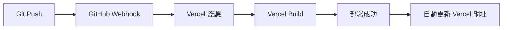

# Go Home App - 完整開發與使用手冊

**最後更新**: 2026-04-13  
**項目負責人**: Jacky (CEO)  
**架構師**: Zendo  
**版本**: V1.0 (PWA 穩定版)

---

## 📑 目錄
1. [項目概述](#1-項目概述)
2. [技術棧與架構](#2-技術棧與架構)
3. [核心功能列表](#3-核心功能列表)
4. [部署位置與訪問方式](#4-部署位置與訪問方式)
5. [使用方法 (用戶指南)](#5-使用方法用戶指南)
6. [開發指南 (工程師指南)](#6-開發指南工程師指南)
7. [自動化部署流程](#7-自動化部署流程)
8. [常見問題與故障排除](#8-常見問題與故障排除)

---

## 1. 項目概述

### 1.1 項目目標
**Go Home** 是一款專為長者設計的**極簡導航 PWA 應用**，幫助用戶快速從「當前位置」導航至「家」。

### 1.2 核心價值
- **極簡操作**：只需點擊一個「GO」按鈕即可出發。
- **三語言支持**：繁體中文 (粵語)、簡體中文、英文。
- **長者友好**：高對比度淺色主題、超大字體、無深色模式。
- **離線可用**：PWA 模式，安裝後可離線使用（除導航外）。

### 1.3 目標用戶
- 長者（65+ 歲）
- 對智能手機操作不熟悉的人群
- 需要快速導航至固定地點的用戶

---

## 2. 技術棧與架構

### 2.1 技術棧
| 組件 | 技術 | 說明 |
|------|------|------|
| **前端框架** | Next.js 14 (App Router) | SSR/SSG 混合渲染，優化了首屏加載速度。 |
| **樣式方案** | Tailwind CSS | 原子化 CSS，快速開發響應式界面。 |
| **語言包** | 自定義 i18n 系統 | `locales.ts` 支持 zh-HK, zh-CN, en。 |
| **圖標庫** | 自定義 SVG | Apple SF Symbols 風格，手動繪製。 |
| **地圖服務** | Google Maps URL Scheme | 使用 `geo:` 協議和 Google Maps 網頁版。 |
| **存儲方案** | localStorage | 本地存儲家地址、字體大小、語言偏好。 |
| **部署平台** | Vercel | 自動構建、全球 CDN、HTTPS 自動配置。 |
| **版本控制** | GitHub | 代碼托管、自動部署觸發。 |

### 2.2 項目結構
```
go_home/
├── app/
│   ├── page.tsx              # 首頁 (Home)
│   ├── settings/
│   │   └── page.tsx          # 設置頁面
│   ├── layout.tsx            # 根布局
│   └── globals.css           # 全局樣式
├── components/
│   ├── GoButton.tsx          # GO 按鈕 (核心)
│   ├── HomeButton.tsx        # Home 按鈕
│   ├── AddressModal.tsx      # 地址輸入對話框
│   ├── BottomNav.tsx         # 底部導航
│   ├── Header.tsx            # 頂部導航欄
│   ├── LanguageSelector.tsx  # 語言選擇器
│   ├── FontSizeSelector.tsx  # 字體大小選擇器
│   └── InstallPrompt.tsx     # PWA 安裝提示
├── locales/
│   └── locales.ts            # 多語言配置
├── public/
│   ├── icon.png              # PWA 圖標
│   ├── logo.png              # 頂部 Logo
│   └── manifest.json         # PWA 配置
├── lib/
│   └── utils.ts              # 工具函數 (cn)
└── package.json              # 依賴配置
```

---

## 3. 核心功能列表

### 3.1 用戶功能
| 功能 | 描述 | 實現方式 |
|------|------|----------|
| **快速導航** | 點擊「GO」按鈕，自動打開地圖 App 導航至家。 | `geo:0,0?q=地址` 協議。 |
| **地址管理** | 在設置頁面輸入、修改、刪除家地址。 | `localStorage` 存儲。 |
| **多語言切換** | 支持 繁中、簡中、英文即時切換。 | `locales.ts` + `useState`。 |
| **字體大小調整** | 標準、大、超大三檔可調。 | Tailwind `text-xl/2xl/3xl`。 |
| **PWA 安裝** | 添加到手機主屏幕，離線可用。 | `manifest.json` + `InstallPrompt`。 |
| **底部導航** | Home / Settings 一鍵切換。 | SPA 模式，`useState` 控制。 |

### 3.2 技術特點
- **SPA 架構**：Home ↔ Settings 瞬間切換，無頁面重載。
- **響應式設計**：完美適配手機、平板、桌面。
- **高對比度**：白底黑字，無深色模式，戶外清晰可見。
- **無後端**：純前端應用，無需 API 服務器。
- **自動化部署**：Git Push → Vercel 自動更新。

---

## 4. 部署位置與訪問方式

### 4.1 代碼托管 (GitHub)
- **倉庫地址**: `https://github.com/zendo00/go-home-app.git`
- **分支策略**: `main` 分支為生產環境。
- **權限**: 私有倉庫，僅 Jacky 和授權開發者可訪問。
- **Webhook**: 自動觸發 Vercel 部署。

### 4.2 生產環境 (Vercel)
- **正式網址**: `https://go-home-app.vercel.app`
- **自定義域名**: (可選) 如 `https://home.yourdomain.com`
- **部署方式**: 自動化 (Git Push → Vercel Build → Deploy)
- **HTTPS**: 自動配置，無需手動設置。

### 4.3 本地開發
- **啟動命令**: `npm run dev`
- **本地訪問**: `http://localhost:3000`
- **構建命令**: `npm run build` (推送前必須成功)

---

## 5. 使用方法 (用戶指南)

### 5.1 首次使用
1. **訪問網址**: 在手機瀏覽器打開 `https://go-home-app.vercel.app`。
2. **安裝 App**:
   - **iOS**: 點擊分享按鈕 → 「加入主畫面」。
   - **Android**: 點擊菜單 (⋮) → 「安裝應用」或「添加到主屏幕」。
3. **設置家地址**:
   - 點擊底部「設置」圖標。
   - 在「家地址」欄位輸入完整地址。
   - 點擊「儲存」按鈕。
4. **調整偏好**:
   - 選擇語言 (繁體/簡體/英文)。
   - 選擇字體大小 (標準/大/超大)。

### 5.2 日常使用
1. **打開 App**: 從手機桌面點擊「Go Home」圖標。
2. **確認地址**: 默認顯示已設置的家地址。
3. **出發**: 點擊巨大的「GO」按鈕。
4. **導航**: 系統自動打開手機默認地圖 App (Google Maps / Apple Maps)。

### 5.3 修改地址
1. 點擊底部「設置」圖標。
2. 修改「家地址」欄位。
3. 點擊「儲存」或「清除地址」。

---

## 6. 開發指南 (工程師指南)

### 6.1 環境要求
- **Node.js**: v22+ (LTS)
- **npm**: v10+
- **Git**: 最新穩定版
- **瀏覽器**: Chrome / Firefox / Safari (最新版本)

### 6.2 本地開發流程
```bash
# 1. 克隆倉庫
git clone https://github.com/zendo00/go-home-app.git
cd go-home-app

# 2. 安裝依賴
npm install

# 3. 啟動本地服務器
npm run dev

# 4. 訪問本地應用
open http://localhost:3000
```

### 6.3 代碼規範
1. **TypeScript 嚴格模式**: 所有變量必須明確定義類型。
2. **Tailwind CSS**: 優先使用原子類，避免自定義 CSS。
3. **組件化**: 每個功能獨立為組件 (如 `GoButton`, `AddressModal`)。
4. **i18n**: 所有用戶可見文本必須通過 `t()` 函數調用。
5. **響應式**: 必須在手機、平板、桌面測試。

### 6.4 關鍵組件說明
| 組件 | 功能 | 關鍵邏輯 |
|------|------|----------|
| `GoButton.tsx` | 核心導航按鈕 | 觸發 `AddressModal`，最終調用 `geo:` 協議。 |
| `AddressModal.tsx` | 地址輸入對話框 | 條件性保存 (標題含「目的地」時不保存)。 |
| `BottomNav.tsx` | 底部導航欄 | SPA 模式，`usePathname` 訂閱路由變化。 |
| `InstallPrompt.tsx` | PWA 安裝提示 | 檢測 `beforeinstallprompt` 事件。 |

### 6.5 常見開發任務

#### 添加新功能
1. 在 `app/` 或 `components/` 創建新文件。
2. 在 `locales.ts` 添加對應文本。
3. 在 `page.tsx` 或相關組件中引入。
4. 本地測試 (`npm run dev`)。
5. 構建測試 (`npm run build`)。
6. 推送 (`git push`)。

#### 修改 UI 樣式
1. 找到對應組件文件 (如 `GoButton.tsx`)。
2. 修改 Tailwind class。
3. 本地預覽效果。
4. 構建並推送。

#### 添加新語言
1. 在 `locales.ts` 添加新語言鍵值對。
2. 更新 `LanguageSelector.tsx`。
3. 測試切換效果。

---

## 7. 自動化部署流程

### 7.1 部署原理


### 7.2 部署步驟
1. **本地修改代碼**。
2. **強制構建測試**:
   ```bash
   npm run build
   ```
   - **必須成功** 才能推送。
3. **提交並推送**:
   ```bash
   git add .
   git commit -m "feat: 添加新功能"
   git push origin main
   ```
4. **等待 Vercel**:
   - 通常 2-3 分鐘完成構建。
   - 可在 Vercel Dashboard 查看進度。
5. **驗證**:
   - 訪問 `https://go-home-app.vercel.app`。
   - 強制刷新 (`Ctrl + Shift + R`)。

### 7.3 故障排除
| 問題 | 原因 | 解決方案 |
|------|------|----------|
| `Type error` | TypeScript 類型不匹配 | 檢查 `useState` 類型和初始值。 |
| `Build failed` | 依賴缺失或語法錯誤 | 本地運行 `npm run build` 修復。 |
| Vercel 顯示舊版本 | 構建緩存 | Vercel Dashboard → Redeploy (取消緩存)。 |
| 界面與本地不一致 | 使用了 `justify-center` | 改用 `justify-start` + `pl-[25%]`。 |

---

## 8. 常見問題與故障排除

### 8.1 用戶端問題
| 問題 | 原因 | 解決方案 |
|------|------|----------|
| 點擊 GO 無反應 | 瀏覽器攔截 | 允許彈出窗口，或手動點擊地址欄。 |
| 地址不保存 | localStorage 被清除 | 重新輸入地址。 |
| 語言切換無效 | 緩存問題 | 強制刷新頁面。 |
| 字體太小 | 未調整設置 | 進入設置頁面選擇「超大」。 |

### 8.2 開發端問題
| 問題 | 原因 | 解決方案 |
|------|------|----------|
| `npm run build` 失敗 | TypeScript 錯誤 | 修復類型錯誤後重試。 |
| Vercel 部署失敗 | Webhook 未觸發 | 手動 Redeploy 或重新連接 GitHub。 |
| 本地能跑，Vercel 掛 | 類型檢查嚴格度不同 | 本地強制 `npm run build`。 |
| 按鈕對齊錯誤 | 使用了 `justify-center` | 改用 `justify-start pl-[25%]`。 |

---

## 📞 支持與反饋

- **技術支持**: 聯繫 Zendo (AI 架構師)。
- **Bug 反饋**: 提交 Issue 到 GitHub 倉庫。
- **功能建議**: 在 `10_projects/go_home/01_ceo/` 創建需求文檔。

---

**本文檔將隨項目迭代而更新，請定期查看最新版本。**
